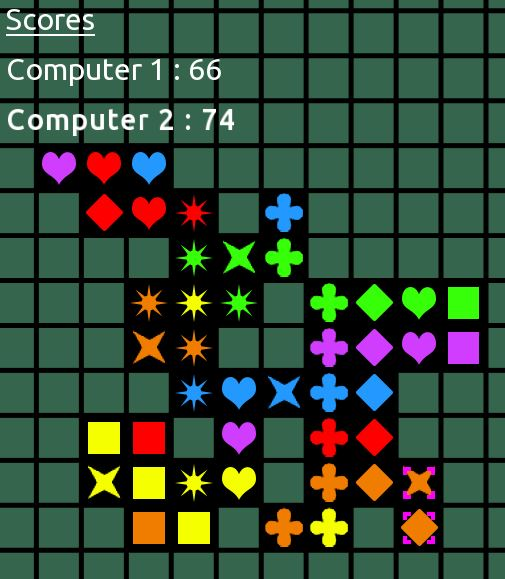

# Qwirkle

The [Qwirkle](https://en.wikipedia.org/wiki/Qwirkle) game in C++, based on the [SFML](https://www.sfml-dev.org/index.php).

### Download

A compiled version for [Windows](https://drive.google.com/file/d/1Gf7k-h0_jVgYyOGlJ-ZrQrKzmFR7-Mci/view?usp=sharing).

### Installation from source

You can compile the source code using CMake and a C++17 compliant compiler.

### How to play

Select the number of players and computer using the arrow keys, and hit Start to begin playing. The computers are greedy and play the first of the moves that score the most.

###### Controls

| Action | Result |
| --- | --- |
| Drag and drop | Move grid |
| Mouse wheel | Zoom in / out |
| Left click | Select tile |
| Right click | Cancel
| C (center) | Center grid |
| E (end), or click on the Right Arrow Logo | End turn |
| H (hint)| Show playable squares for the currently selected tile |
| R (recycle), or click on the Recycling Logo | Select tiles to put back in reserve, same action to confirm |
| T (toggle) | Toggle last move markers visibility |
| 1 - 6 keys | Select the corresponding tile |

### Configuration

You can change configuration parameters in the file ./rc/config.txt . \
Notably, you can enable the **colorblind mode** by adding "colorblind = btrue" in this file. \
You can add a **locale** by copying and updating the file ./rc/locales/default.txt, and writing its new name in the config file.

### Online

You should port-forward from your public IP address to your machine (the port number is configurable). \
Alternatively, you should create a virtual LAN with a service like [Hamachi](https://www.vpn.net/) (free up to 5 players, requires an account).
Here is a tutorial on how to setup it [[French](https://drive.google.com/file/d/1bOdHEey2fI3HkdzhpJf1VlbKUUWIriXy/view?usp=sharing)].